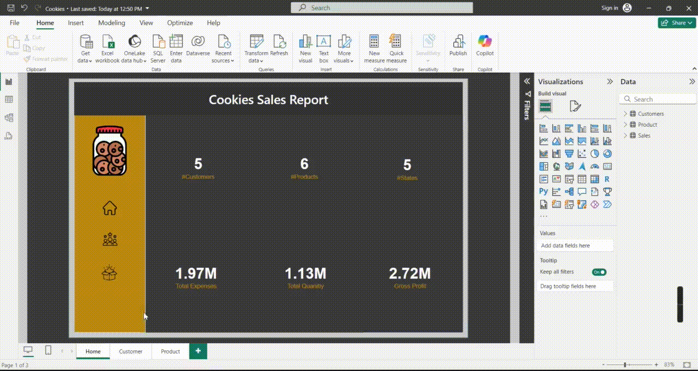
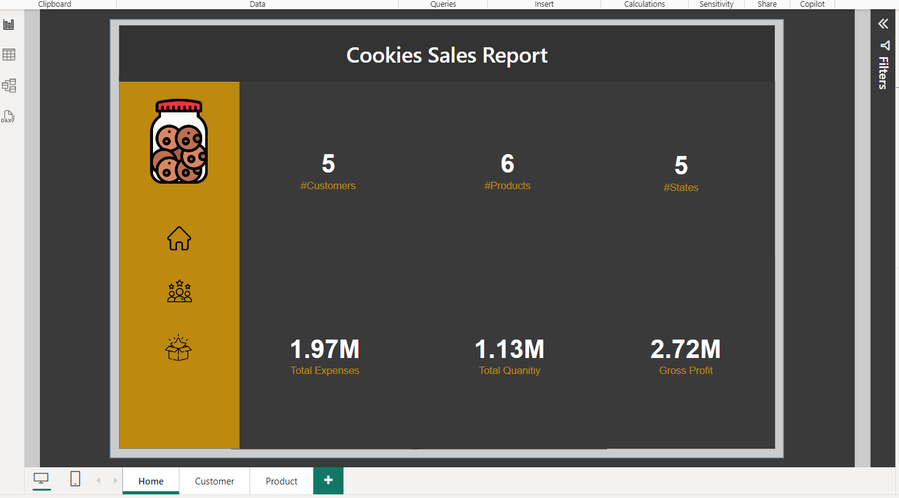

<h1 align="center">🍪 Cookies Shop Sales Report - Power BI Dashboard 📊</h1>

 <!-- Replace with actual gif link -->

Welcome to the **Cookies Shop Sales Report** repository! This project uses Power BI to analyze sales data and provide key insights into different aspects of the business. Dive into interactive visualizations and explore how data can drive better decision-making for a cookie shop business.

---

## 📋 Project Overview

This Power BI dashboard provides an in-depth analysis of the sales data for a cookies shop. The dashboard is segmented into the following view tabs:

### 🔍 View Tabs:

1. **Overview**: 
   - A comprehensive summary of the shop's overall performance, including total sales, revenue trends, and profitability.

2. **Customer**:
   - Insights into customer demographics, buying patterns, and loyalty metrics. Visualizations of top customers, customer segmentation, and retention rates.

3. **Product**:
   - Product-specific analysis, highlighting best-sellers, underperforming items, and revenue contribution by product category.

4. **Model**:
   - Predictive modeling, including sales forecasting, demand planning, and correlation analysis to optimize stock levels and future strategies.

5. **Table**:
   - A detailed data table showcasing raw sales numbers, enabling further exploration and custom analysis.

---

## 📈 Key Insights

- **Overall Sales Performance**: Tracks the total sales and average sales per customer over time.
- **Customer Segmentation**: Analyzes the customer base by location, age group, and purchasing frequency.
- **Product Profitability**: Highlights the most and least profitable products and helps in optimizing stock inventory.
- **Sales Forecasting**: Uses predictive analytics to forecast future sales trends based on historical data.

---

## 🎯 Data Analysis Features

- **Interactive Visuals**: Use of Power BI’s dynamic visuals for filtering data in real-time.
- **Advanced Modeling**: Statistical models to predict trends and customer behavior.
- **User-Friendly Interface**: Intuitive navigation through the dashboard with clear labels and actionable insights.

---

## 🛠️ Technologies Used

- **Power BI**: For building dashboards and creating data models.
- **Excel/CSV**: For raw data collection and preprocessing.
- **DAX**: For advanced calculations and custom measures in Power BI.

---

## 📊 Visuals

 <!-- Replace with actual image link -->
_Example of the **Overview Tab** in the dashboard, showing key KPIs and total sales trends._

 <!-- Replace with actual image link -->
_Example of the **Customer Tab**, showcasing customer demographics and purchase frequency._

 <!-- Replace with actual image link -->
_Example of the **Product Tab**, highlighting the sales contribution of different products._

---

## 🚀 Getting Started

To explore the Power BI dashboard:

1. **Download the `.pbix` file** from this repository.
2. **Open it in Power BI Desktop** to interact with the report.
3. **Ensure your data source is configured** properly to view updated visuals and insights.

---

## 🧑‍💻 Usage Instructions

- You can filter by specific dates, customer categories, or product types to get custom insights.
- Use the navigation tabs to switch between different views (Overview, Customer, Product, Model, Table).

---

## 🤝 Connect with Me

Feel free to reach out if you have any questions or suggestions!

📧 Email: [mariamrashad062@gmail.com](mailto:mariamrashad062@gmail.com)  
👔 LinkedIn: [Your LinkedIn Profile](https://www.linkedin.com/in/your-profile)

---

<h3 align="center">📊 Power BI | 🧁 Data Analytics | 💻 Business Insights</h3>
